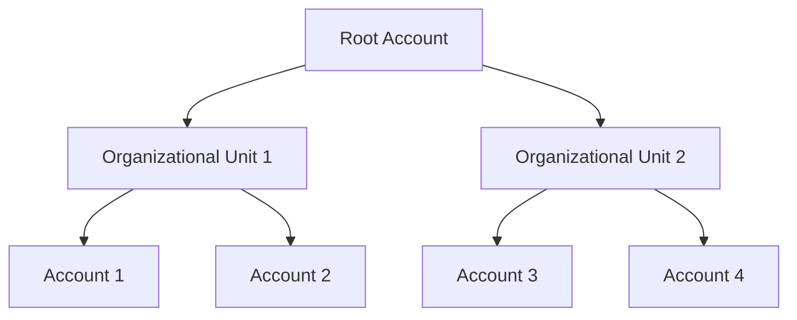

# AWS Organizations

## Overview

AWS Organizations is a service that allows you to centrally manage and govern your environment as you grow and scale your AWS resources. It enables you to consolidate multiple AWS accounts into an organization that you create and centrally manage. With AWS Organizations, you can automate account creation, apply policies to groups of accounts, and simplify billing by using a single payment method for all your accounts.

## Why Use AWS Organizations?

1. **Centralized Management**: Manage multiple AWS accounts from a single location. This makes it easier to apply policies and monitor usage across all accounts.

2. **Cost Management**: Consolidate billing across all your AWS accounts to take advantage of volume pricing discounts and simplify the billing process.

3. **Security and Compliance**: Apply Service Control Policies (SCPs), Resource Control Policies (RCPs), Declarative Policies, Tagging Policies, AI Policies, and more to ensure that accounts adhere to your organization's security and compliance requirements.

4. **Automation**: Automate the creation of new accounts and the application of policies, reducing the administrative overhead and potential for human error.

5. **Resource Sharing**: Share resources such as AWS Transit Gateway, AWS License Manager, and AWS Directory Service across accounts within your organization.

6. **Scalability**: Easily scale your environment by adding new accounts as your organization grows, without the need for complex account management processes.

By using AWS Organizations, you can streamline your AWS account management, enhance security, and optimize costs, making it an essential tool for any organization using AWS at scale.

## AWS Organizations Diagram

Below is a diagram depicting an AWS Organization structure:

In this diagram:
- The **Root Account** is the `management` account that creates the organization.
- **Organizational Units (OUs)** are used to group accounts for easier management.
- **Accounts** are individual AWS accounts within the organization called `member` accounts.

---
## Terraform Deployment Code
Within `.code/main.tf`, I've provided Terraform code for creating an AWS Organization, AWS Organizational Units (OUs), and AWS Accounts. This code will help you automate the setup of your AWS Organization structure, including the creation of OUs and the addition of member accounts.