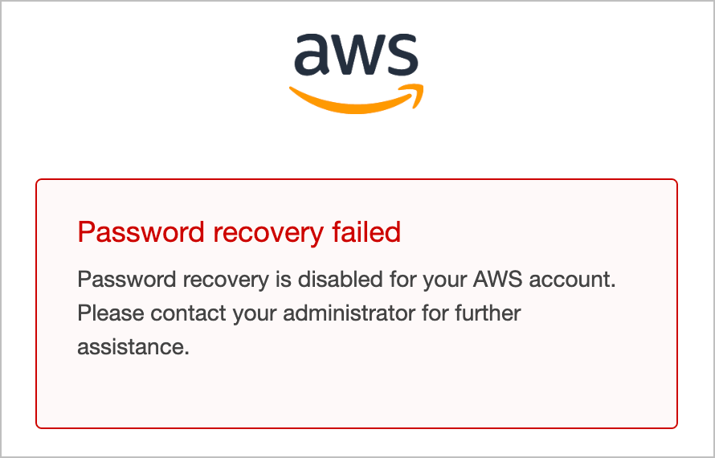

# Overview

## What is AWS Root Account Management?

When a new AWS account is created, it includes a Root user with full access to all AWS services and resources. This presents a significant security risk if the Root user credentials are compromised.

With AWS Root Account Management, we gain several key security benefits:

1. **Prevent New Root Users**: 
- Once enabled, it prevents the creation of Root users in new AWS member accounts.
- Password resets for the Root user are also disabled.



3. **Visibility**: 
We gain insights into:
    - Which AWS accounts have the Root user enabled
    - Whether the Root user has MFA enabled
    - Whether the Root user has a console password set
    - Whether the Root user has Signing Certificates enabled


4. **Privileged Actions**:
- We can perform select privileged actions in an AWS member account as shown in the screenshot below
    - **Delete S3 bucket policy**: Useful when you've misconfigured a bucket policy and locked yourself out. We can use the Root user to resolve.
    - **Delete SQS queue policy**: Useful when you've misconfigured a queue policy and locked yourself out. We can use the Root user to resolve.
    - **Delete root user credentials**: Removes the Root user from a member account.


## How We Managed Root Users Before
Security best practice dictates that the Root user should not be used for day-to-day operations and must be secured with MFA. 

Not using the Root user is easy enough as we can create IAM identities with similar privileges. However, enforcing MFA for Root users across hundreds of AWS accounts in an enterprise setting can be a major challenge.

- Hardware MFA tokens must be purchased, distributed, and managed
- Lost tokens or staff turnover create additional risks

One way we can solve for this is by creating an AWS Service Control Policy (SCP) that denies all Root user actions.

```json
{
  "Version": "2012-10-17",
  "Statement": [
    {
      "Sid": "RestrictRootActions",
      "Effect": "Deny",
      "Action": [
        "*"
      ],
      "Resource": [
        "*"
      ],
      "Condition": {
        "StringLike": {
          "aws:PrincipalArn": [
            "arn:aws:iam::*:root"
          ]
        }
      }
    }
  ]
}
```

However, SCPs do not impact the AWS Management account, meaning we still need to secure that account's Root user with a strong password and MFA enabled.

----
## Resources
- [Centralize root access for member accounts](https://docs.aws.amazon.com/IAM/latest/UserGuide/id_root-enable-root-access.html)

----
## Terraform Deployment Code
The Terraform code to enable IAM Trusted Access (pre-requisite) and AWS Root Account Management can be found in:

📂 `aws_rootAccountManagement/code/main.tf`

The code has been left in a simplified state (i.e., not using modules, loops, or other advanced Terraform features) to be more easily accessible. You can customize it further to meet your specific requirements.